# 🐳 Laboratorio Contenedores 🐳

## 🎯 Los 4 Retos

El objetivo es tener esta aplicación funcionando completamente en contenedores, la cual es un calendario de las clases de Lemoncode 🍋🗓️


La misma aplicación está disponible en dos stacks tecnológicos diferentes para el backend: .NET y Node.js. El frontend es idéntico en ambos casos. ¡Tú eliges cuál usar! 

Está compuesta de tres componentes principales:

- 🌐 **Frontend**: Una interfaz con Node.js
- ⚙️ **Backend**: Elige tu aventura - .NET (`dotnet-stack`) o Node.js (`node-stack`) que se conecta con MongoDB
- 🗄️ **Base de datos**: MongoDB para almacenar toda la información

> 💡 **¡Libertad de elección!** Como habrás notado, tienes dos carpetas: `dotnet-stack` y `node-stack`. El frontend es idéntico en ambos casos, solo cambia el backend. ¡Elige el que más te motive! O puedes hacer las dos si quieres.

---

### 🔥 Reto 1: MongoDB en Contenedor

**Objetivo**: Ejecutar MongoDB dentro de un contenedor y conectar el backend (ejecutándose localmente) para que pueda recuperar, crear, modificar y eliminar clases de la base de datos.

#### 📋 Requisitos:
1. ✅ Crear una red Docker para la comunicación
```bash
docker network create lemoncode-network
docker network ls
```

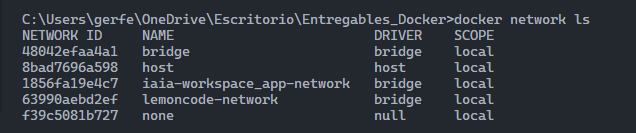

1. ✅ Ejecutar MongoDB en un contenedor con persistencia de datos
```bash
docker run -d \
  --name mongodb \
  --network lemoncode-network \
  -p 27017:27017 \
  -e MONGO_INITDB_ROOT_USERNAME=admin \
  -e MONGO_INITDB_ROOT_PASSWORD=admin123 \
  -v mongo-data:/data/db \
  mongo:8.0
```

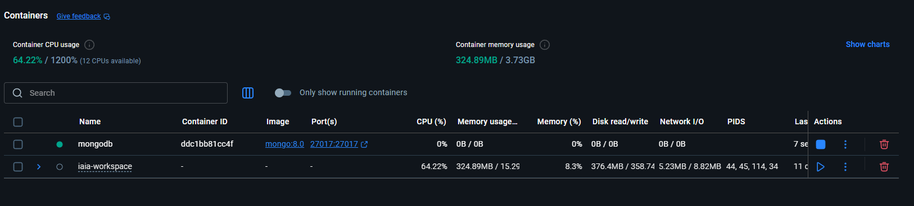

1. ✅ Ejecutar el backend localmente conectándose a tu nuevo MongoDB
```bash
cd Laboratorio/node-stack/backend
npm install

# Creado archivo ".env" para llamar correctamente a base de datos y asignandole un puerto al back, 
# evidentemente esto no se debería subir al repo pero vaya es una práctica no voy a exponer mi 
# API key de Claude Code. 
npm start
```

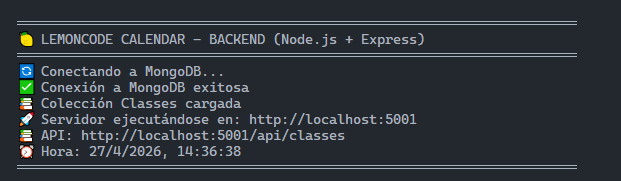

4. ✅ Verificar que el CRUD funciona correctamente usando la extensión REST Client y el archivo `backend/client.http` del stack que hayas elegido

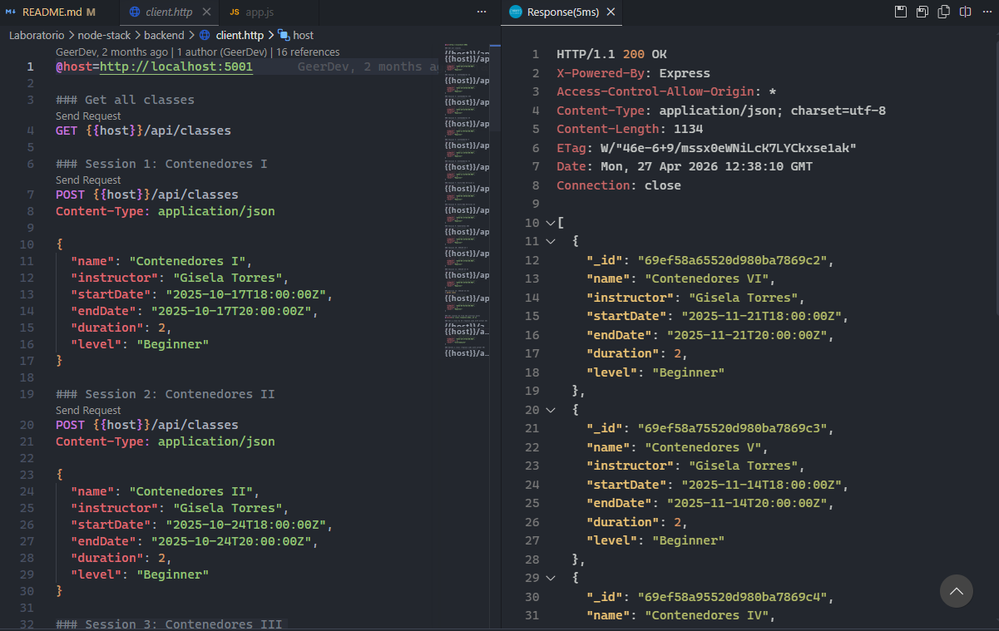

5. ✨ Puedes instalar la extensión de [MongoDB for VS Code](https://marketplace.visualstudio.com/items?itemName=mongodb.mongodb-vscode) o usar MongoDB Compass para verificar que los datos se almacenan correctamente.

Por cambiar un poco, voy a probar "TablePlus" que tenia para darle una oportunidad:

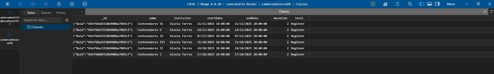

¡Perfecto! Si has llegado hasta aquí, ya tienes MongoDB corriendo en un contenedor y tu backend puede comunicarse con él. ¡Buen trabajo! 🎉

---

### 🐳 Reto 2: Dockerizar el Backend

**Objetivo**: Crear un Dockerfile para el backend y ejecutarlo en contenedor, conectado a MongoDB via red Docker.

#### 📋 Requisitos:
1. ✅ Crear un Dockerfile para el backend (para .NET para o Node.js)

También se ha creado el archivo ".dockerignore"
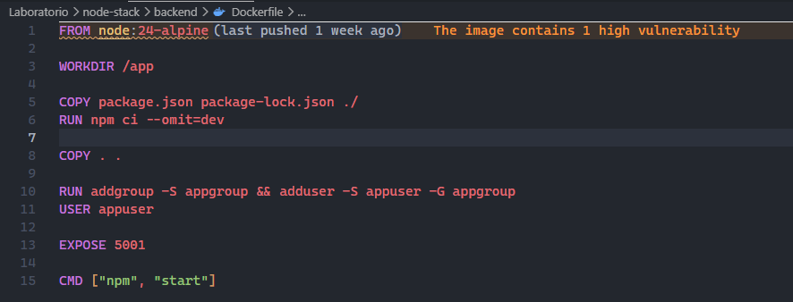

2. ✅ Construir la imagen del backend
```bash
docker build -t topics-api ./Laboratorio/node-stack/backend
```

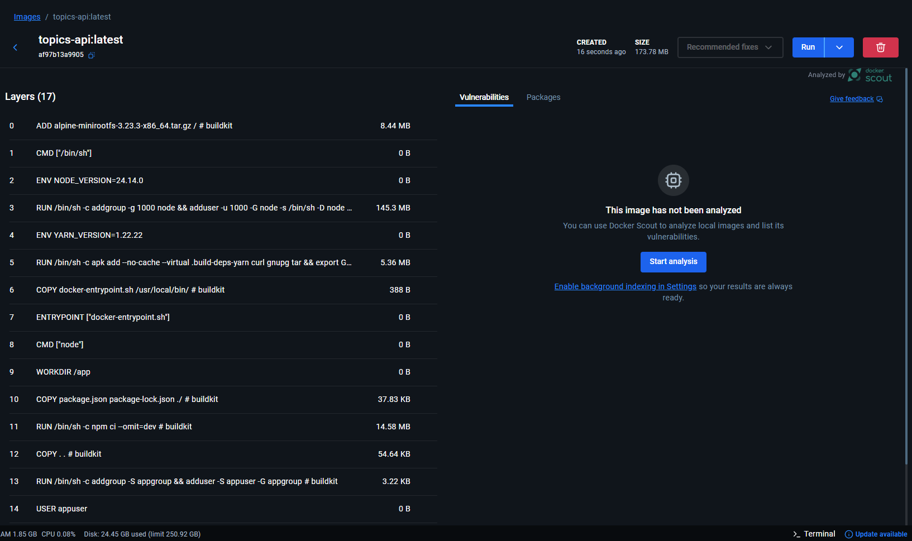

3. ✅ Ejecutar el backend en un contenedor en la red Docker que creaste en el Reto 1
```bash
docker run -d \
  --name topics-api \
  --network lemoncode-network \
  -p 5001:5001 \
  --env-file ./Laboratorio/node-stack/backend/.env.docker \
  topics-api
```

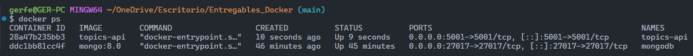

4. ✅ Verificar que se conecta correctamente a MongoDB
```bash
docker network inspect lemoncode-network
```

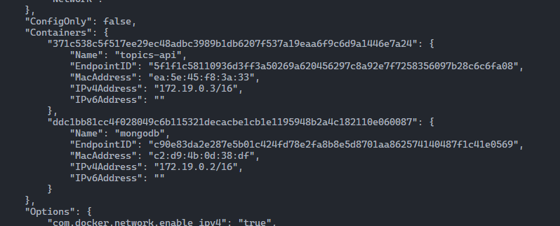

```bash
docker logs topics-api
```

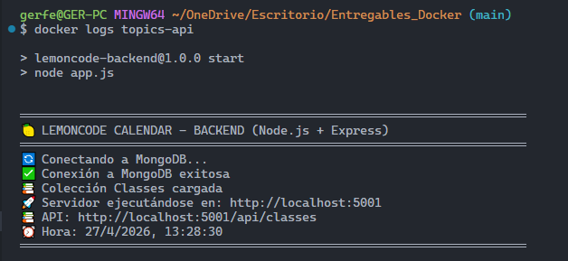

5. ✅ Exponerse el puerto 5001 para que sea accesible

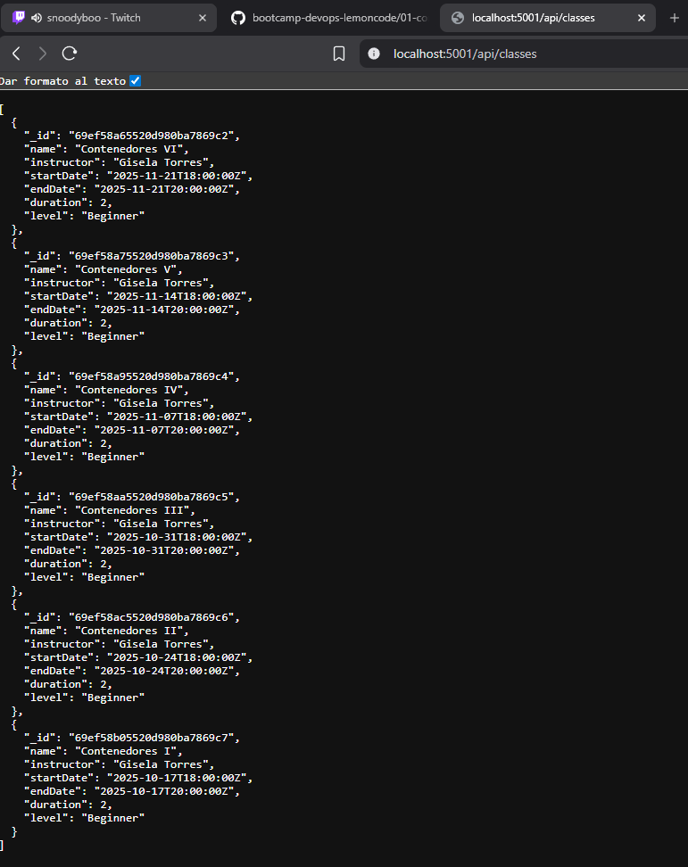

#### 💡 Tips:
- Define variables de entorno adecuadas para la conexión a MongoDB
- Asegúrate de que la imagen sea lo más eficiente posible
- Usa puertos correctos (5001 para la API)

---

### 🎨 Reto 3: Dockerizar el Frontend

**Objetivo**: Crear un Dockerfile para el frontend y ejecutarlo en contenedor, conectado al backend via red Docker.

#### 📋 Requisitos:
1. ✅ Crear un Dockerfile para el frontend

También se ha creado el archivo ".dockerignore"
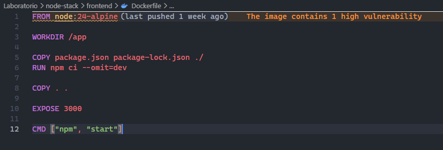


2. ✅ Construir la imagen del frontend
```bash
docker build -t lemoncode-frontend ./Laboratorio/node-stack/frontend
```

3. ✅ Ejecutar el frontend en un contenedor en la red Docker
```bash
docker run -d \
  --name lemoncode-frontend \
  --network lemoncode-network \
  -p 3000:3000 \
  --env-file ./Laboratorio/node-stack/frontend/.env.docker \
  lemoncode-frontend
```

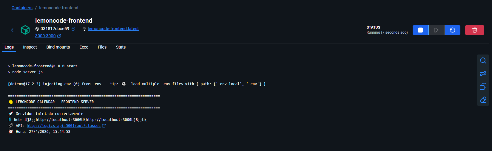

4. ✅ Configurar las variables de entorno para conectarse al backend en `http://topics-api:5001/api/classes`

Ya están configuradas en el archivo ".env.docker" que es el que se utiliza cuando se construye el contenedor.

5. ✅ Acceder a la interfaz desde el navegador en el puerto 3000

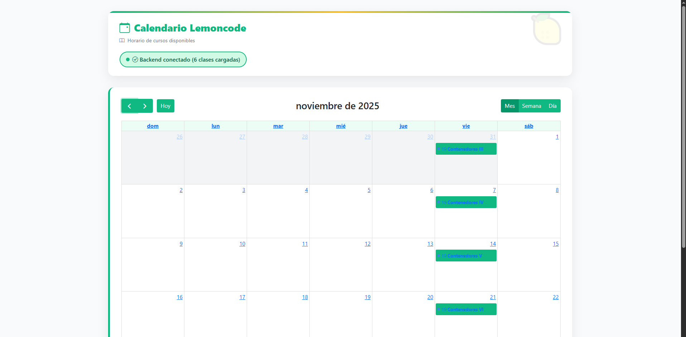

#### 💡 Tips:
- El frontend debe ser accesible desde http://localhost:3000
- Configura las variables de entorno para apuntar al backend correcto
- A través de los terminales de ambos componentes, e incluso desde la propia web podrás verificar que todo funciona correctamente

---

### 🎪 Reto 4: Docker Compose - Todo Junto

**Objetivo**: Usar Docker Compose para orquestar todos los servicios (MongoDB, Backend, Frontend) como un director de orquesta.

#### 📋 Requisitos:
1. ✅ Crear un `compose.yml` que incluya los tres servicios
2. ✅ Configurar la red compartida `lemoncode-network`
3. ✅ Definir volumen para persistencia de MongoDB
4. ✅ Establecer todas las variables de entorno necesarias
5. ✅ Exponer los puertos correctos (3000 para frontend, 5001 para API, 27017 para MongoDB)
6. ✅ Definir dependencias entre servicios
7. ✅ Levantar toda la aplicación con un único comando
8. ✅ Acceder a la aplicación desde el navegador en http://localhost:3000 

#### 💡 Tips:
- Usa `depends_on` para ordenar el inicio de los servicios
- Mapea el volumen para persistencia de datos
- Define claramente las variables de entorno para cada servicio
- Documenta los comandos útiles (up, down, logs, etc.)

**Nota 1**: Nunca subiría archivos con variables de entorno a ningún sitio, solo las he dejado en este repositorio con fines educativos. 
**Nota 2**: He intentando a veces mostrar comandos por consola y otras veces directamente imágenes de Docker Desktop para que hubiera un poco de todo.

**Nota 3**: Si haber entregado estos ejercicios significa ya no volver a asistir a tus clases Gis, entonces haz como que no he entregado nada


Apartado personal para ver que implementar aquí:
- Podemos meter un nginx que actue como un proxy inverso para montar los 2 stacks a la vez.
- Como hacer peticiones al back: Curl, Postman, directamente con consultas en mongo.
- Me gustaría utilizar Tableplus.
- ¿Donde están las variables de entorno en el back de .net?
- Prueba a mapear los mismos puertos en el front y en el back y explica porque puedes hacerlo funcionar.
- Estaría bien crear unos scripts de copia de bases de datos, back ups, esto solo por la ciencia.
- ¿Utilizamos mongo express?
- Utiliza la propiedad "healthcheck" con el compose para ver como funciona.
- Averigua como crear seeders en base de datos.
- Averigua donde guarda un contenedor MongoDB la información de la bd.
- Levanta dev container para el stack de .net.
- El contenedor de  dotnet: 
  - https://hub.docker.com/r/microsoft/dotnet-sdk
  - https://mcr.microsoft.com/en-us/artifact/mar/dotnet/sdk/tag/8.0-alpine